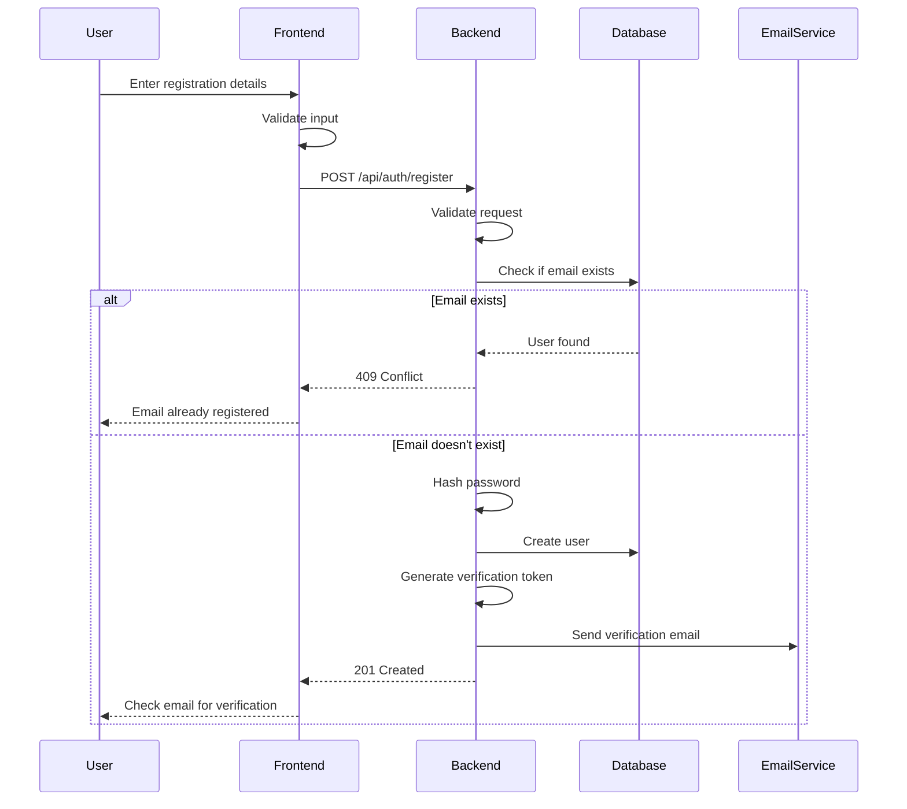
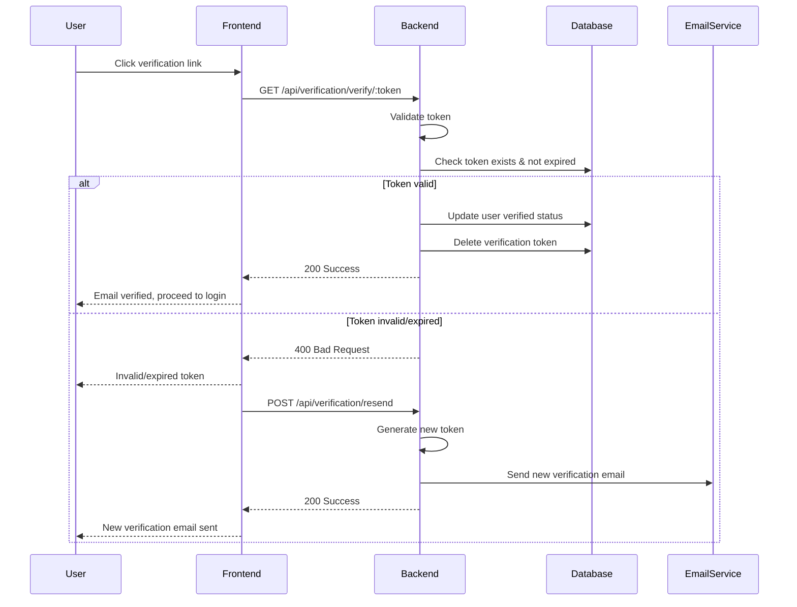
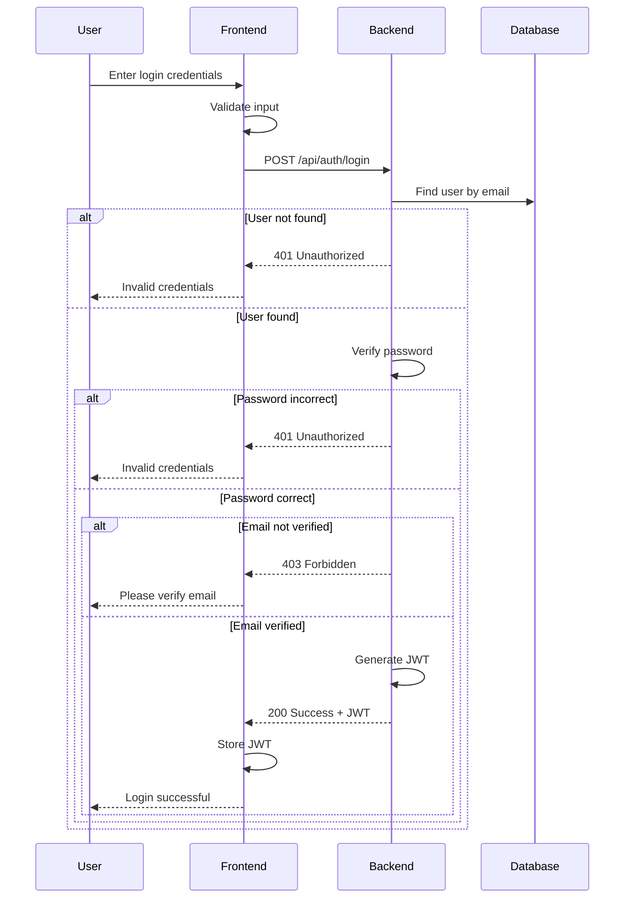
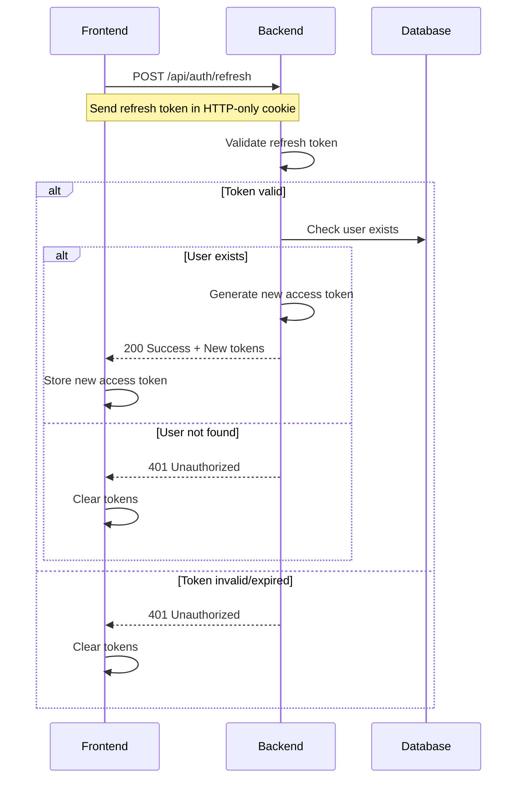
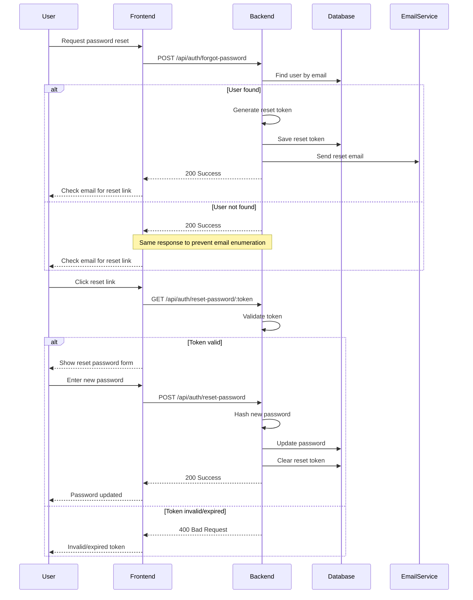

# Authentication Flows Documentation

This document outlines the authentication flows in the Hebrew Learning platform.

## Table of Contents
1. [Registration Flow](#registration-flow)
2. [Email Verification Flow](#email-verification-flow)
3. [Login Flow](#login-flow)
4. [Token Refresh Flow](#token-refresh-flow)
5. [Password Reset Flow](#password-reset-flow)

## Registration Flow



## Email Verification Flow



## Login Flow



## Token Refresh Flow



## Password Reset Flow



## Security Considerations

### JWT Token Security
- Access tokens are short-lived (15 minutes)
- Refresh tokens are longer-lived (7 days)
- Tokens are stored in HTTP-only cookies
- CSRF protection is implemented
- Secure and SameSite flags are set in production

### Password Security
- Passwords are hashed using bcrypt
- Minimum password requirements enforced
- Rate limiting on auth endpoints
- Account lockout after failed attempts

### Email Security
- Verification required for new accounts
- Secure reset password flow
- Rate limiting on email endpoints
- No email enumeration possible

## Implementation Details

### JWT Token Structure
```javascript
{
  "header": {
    "alg": "HS256",
    "typ": "JWT"
  },
  "payload": {
    "userId": "uuid",
    "email": "user@example.com",
    "iat": 1516239022,
    "exp": 1516239922
  }
}
```

### HTTP-Only Cookie Configuration
```javascript
{
  httpOnly: true,
  secure: process.env.NODE_ENV === 'production',
  sameSite: 'strict',
  maxAge: 7 * 24 * 60 * 60 * 1000 // 7 days
}
```

### Error Response Format
```javascript
{
  "error": {
    "code": "AUTH_ERROR",
    "message": "Detailed error message",
    "status": 401
  }
}
```

## API Endpoints

### Authentication
- `POST /api/auth/register` - Register new user
- `POST /api/auth/login` - Login user
- `POST /api/auth/logout` - Logout user
- `POST /api/auth/refresh` - Refresh access token
- `GET /api/auth/me` - Get current user

### Email Verification
- `GET /api/verification/verify/:token` - Verify email
- `POST /api/verification/resend` - Resend verification email

### Password Reset
- `POST /api/auth/forgot-password` - Request password reset
- `GET /api/auth/reset-password/:token` - Validate reset token
- `POST /api/auth/reset-password` - Reset password

## Environment Variables
```env
JWT_SECRET=your-jwt-secret
JWT_REFRESH_SECRET=your-refresh-secret
JWT_ACCESS_EXPIRY=15m
JWT_REFRESH_EXPIRY=7d
SMTP_HOST=smtp.example.com
SMTP_PORT=587
SMTP_USER=your-smtp-user
SMTP_PASS=your-smtp-password
CLIENT_URL=http://localhost:5174
```

## Best Practices

1. **Token Management**
   - Store tokens in HTTP-only cookies
   - Implement token refresh mechanism
   - Clear tokens on logout
   - Validate tokens on every request

2. **Password Security**
   - Use strong password hashing
   - Implement password complexity rules
   - Rate limit authentication attempts
   - Secure password reset flow

3. **Error Handling**
   - Use consistent error formats
   - Don't leak sensitive information
   - Log authentication failures
   - Implement proper error responses

4. **Email Security**
   - Verify email addresses
   - Rate limit email sending
   - Use secure SMTP connection
   - Implement email templates
